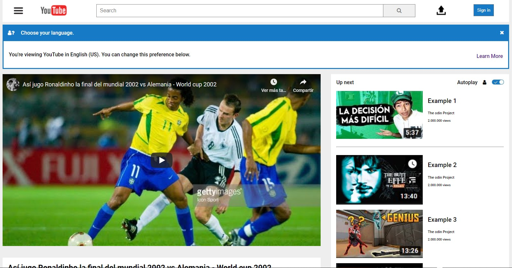

# Youtube Clone - Basic HTML/CSS Page

> We create a clone of a youtube webview from scratch.

This webpage was the project number 1 from microverse curriculum.
We intend to make the page the most similar as the original one.

## Built With
git 
- HTML5 
- CSS3 
- Git 
- Github
- Lintern
- VSCode

## Live Demo

[Live Demo Link](https://aristides1000.github.io/basic-html-page-structure/)

## Getting Started

**This is an example of how you may give instructions on setting up your project locally.**
**Modify this file to match your project, remove sections that don't apply. For example: delete the testing section if the currect project doesn't require testing.**

To get a local copy up and running follow these simple example steps.

### Prerequisites

### Setup

### Install

### Usage

### Run tests

### Deployment

## Authors

👤 **Author1**
Aristides Jose Molina

- GitHub: [@githubhandle](https://github.com/aristides1000)
- Twitter: [@twitterhandle](https://twitter.com/@aristides_1000)
- LinkedIn: [LinkedIn](https://www.linkedin.com/in/aristides-jose-molina-perez-09b0579a)

👤 **Author2**
Carlos Eduardo Ospina
- GitHub: [@githubhandle](https://github.com/carloso0114)
- Twitter: [@twitterhandle](https://twitter.com/Carlos_Osp1)
- LinkedIn: [LinkedIn](https://www.linkedin.com/in/carlos-ospina-242b831a6/)

## 🤝 Contributing

Contributions, issues, and feature requests are welcome!

Feel free to check the [issues page](issues/).

## Show your support

Give a ⭐️ if you like this project!

## Acknowledgments

Ariel Camus CEO Microverse - For letting us start this journey
Google - For letting us find crucial information in order to create this project

## 📝 License

This project is [MIT](lic.url) licensed.
